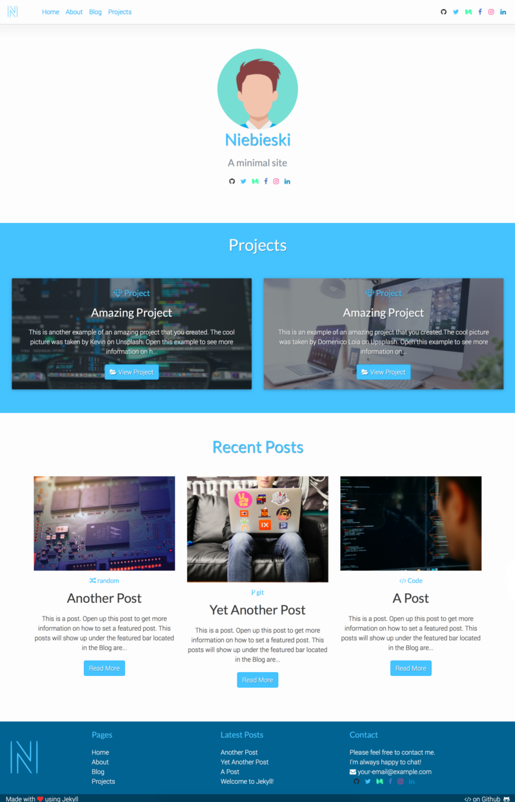

# Niebieski

Niebieski it's the Polish word for the colour blue, which is the dominant colour in this minimal Jekyll theme. 

**Home Page View**



## Installation

Add this line to your Jekyll site's `Gemfile`:

```ruby
gem "Niebieski"
```

And add this line to your Jekyll site's `_config.yml`:

```yaml
theme: Niebieski
```

And then execute:

    $ bundle

Or install it yourself as:

    $ gem install Niebieski

## Usage

TODO: Write usage instructions here. Describe your available layouts, includes, and/or sass.

## Resources 

This theme was created with the following resources:
- [Bootstrap 4](http://getbootstrap.com)
- [Font Awesome Icons](http://fontawesome.io)
- <a href="https://www.freepik.com/free-photos-vectors/business">Business vector created by Freepik</a>
- Icon Finder - [Python Icon](https://www.iconfinder.com/icons/1378016/circle_code_hovytech_media_programming_python_social_icon#size=128)
- Posts and projects images taken from [unsplash](https://unsplash.com/)


## Contributing

Bug reports and pull requests are welcome on GitHub at https://github.com/FabioRosado/Niebieski. This project is intended to be a safe, welcoming space for collaboration, and contributors are expected to adhere to the [Contributor Covenant](http://contributor-covenant.org) code of conduct.

## Development

To set up your environment to develop this theme, run `bundle install`.

Your theme is setup just like a normal Jekyll site! To test your theme, run `bundle exec jekyll serve` and open your browser at `http://localhost:4000`. This starts a Jekyll server using your theme. Add pages, documents, data, etc. like normal to test your theme's contents. As you make modifications to your theme and to your content, your site will regenerate and you should see the changes in the browser after a refresh, just like normal.


## License

The theme is available as open source under the terms of the [MIT License](https://opensource.org/licenses/MIT).

